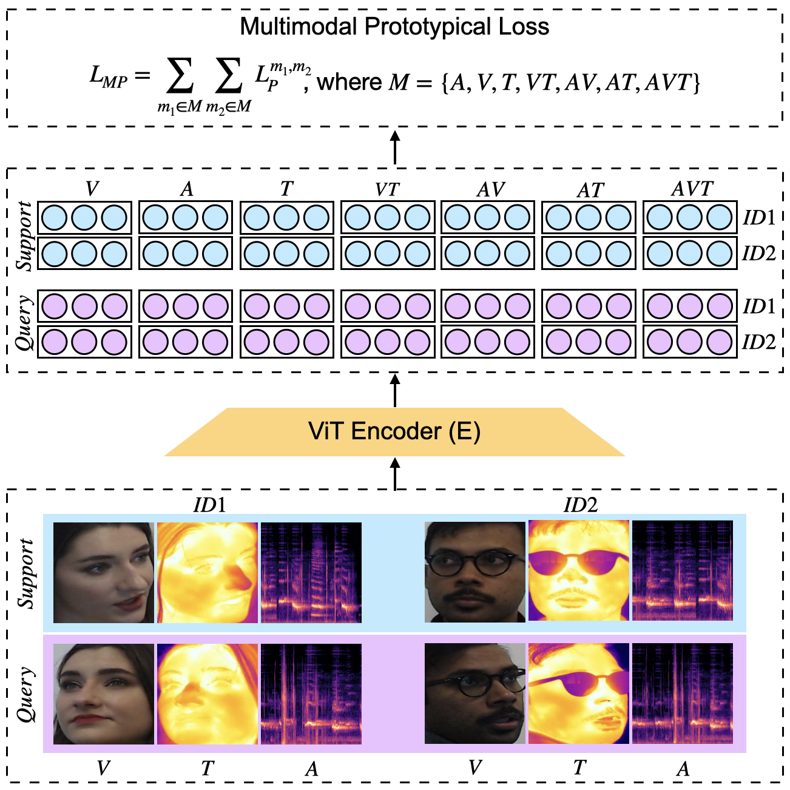

One Model to Rule Them All: Unified Transformer for Biometric Matching
==


We present a transformer-based model for biometric verification, leveraging the adaptability of transformer architectures. Our approach involves joint training on audio, visual, and thermal data within a multimodal framework. By converting all three data types into an image format, we construct a unified system utilizing the Vision Transformer (ViT) architecture, with fully shared model parameters. Additionally, we extend the prototypical loss to accommodate the multimodal data, enabling the model to learn from all possible combinations of input modalities. 

## Getting Started
The following command launches training of our trimodal unified transformer on SpeakingFaces dataset
```
python main.py --data_type rgb wav thr --annotation_file annotations/annotations_file_SF_train_cleaned.csv --path_to_train_dataset $data_dir --path_to_valid_dataset $valid_dir --path_to_valid_list $valid_list --save_dir results --exp_name exp1 --num_epochs $n_epochs --n_ways 40 --n_batch 300 --lr 0.000004--weight_decay 0.01
```
The following command launches training of our audio-visual unified transformer on VoxCeleb dataset

## Reference
