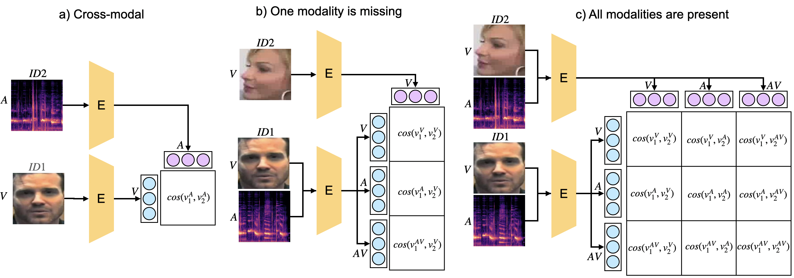

# One Model to Rule Them All: Unified Transformer for Biometric Matching


**Figure 1:** This figure demonstrates the flexibility of our system in handling different biometric matching scenarios . It showcases cross-modal matching (e.g., face vs. voice), cases where one modality is missing, and scenarios where all modalities are available.

Abstract: *We present a transformer-based model for biometric verification in unimodal, multimodal, cross-modal, and missing modality situations, leveraging the adaptability of transformer architectures. Our approach involves joint training on audio, visual, and thermal data within a multimodal framework. By converting all three data types into an image format, we construct a unified system utilizing the Vision Transformer (ViT) architecture, with fully shared model parameters,  enabling the encoder to transform input modalities into a unified vector space. The multimodal prototypical network loss function ensures that vector representations of the same speaker are proximate regardless of their original modalities. We evaluated our approach on SpeakingFaces and VoxCeleb datasets, where the trimodal model achieves an Equal Error Rate (EER) of 0.27% on the SpeakingFaces test split, surpassing all previously reported results, and in cross-modal evaluation on the VoxCeleb1 test set (audio versus visual), our approach yields an EER of 24.1%, again outperforming state-of-the-art models.*


## Dataset

The preprocessed data used for our experiments can be downloaded from [Google Drive](https://drive.google.com/drive/folders/16T3FKwBbCkrgaJhEGFDw8pqR_z30eP7U?usp=sharing).

The *SpeakingFaces* directory contains the compressed version of the preprocessed data used for the reported experiments on SpeakingFaces dataset. The train set is split into 5 parts that should be extracted into the same location. For each utterance in the train split, only the first frame (visual and thermal) is selected. For each utterance in the test and validation splits, 10 equidistant frames (visual and thermal) are selected. All 7 parts of the data, should be extracted to the same folder. 

The *SpeakingFaces/metadata* contains lists prepared for the train, validation, and test sets:
1) *train_list.txt* contains the paths to the recordings and the corresponding subject identifiers present in SpeakingFaces. 
2) The *valid_list.txt* and *test_list.txt* consist of randomly generated positive and negative pairs taken from the validation and test splits of SpeakingFaces, respectively. For each subject, the same number of positive and negative pairs were selected. In total, the numbers of pairs in the validation and test sets are 38,000 and 46,200, respectively.

The *VoxCeleb1* directory contains the compressed version of the preprocessed data used for the reported experiments on the VoxCeleb1 test split. The test set is split into 2 parts that should be extracted into the same location. For each utterance, 10 equidistant frames (visual and thermal) are selected. 
The *VoxCeleb1/metadata* contains the *test_list.txt*, provided first by original authors.

## Training new network
The following command start training the model of the given modalities.

This is the most basic form:
```
python main.py --data_type rgb wav thr --annotation_file annotations/annotations_file_SF_train_cleaned.csv --path_to_train_dataset $data_dir --path_to_valid_dataset $valid_dir --path_to_valid_list $valid_list --save_dir results
```

In config.yaml, all default training parameters are specified. You can change them or provide a custom config.

- `--data_type`: allows to chose modality of the model
     unimodal:'rgb', 'thr', 'wav'
     bimodal: 'rgb wav' ,'rgb thr', 'wav thr'
     trimodal: 'rgb wav thr'
     Note: all three modalities can be used on SpeakingFaces dataset,  'rgb' and 'wav', and their combination only can be used in case of VoxCeleb dataset
- `--annotation_file ./annotations/ANNOTATIONS_FILE_NAME`: path to the annotation file
- `--path_to_train_dataset PATH_TO_TRAIN_DATASET`:
- `--path_to_valid_dataset PATH_TO_VALID_DATASET`
- `--path_to_valid_list  PATH_TO_VALID_LIST`
- `--save_dir PATH_TO_DIRECTORY`: path to the directory where the model will be saved
<!-- - `--exp_name`  TODO should not be the parameter-->
<!-- - `--config_file PATH_TO_CONFIG_FILE` -- TODO add this if possible -->
<!-- ```
python main.py --data_type rgb wav thr --annotation_file annotations/annotations_file_SF_train_cleaned.csv --path_to_train_dataset $data_dir --path_to_valid_dataset $valid_dir --path_to_valid_list $valid_list --save_dir results --exp_name exp1 --num_epochs $n_epochs --n_ways 40 --n_batch 300 --lr 0.000004--weight_decay 0.01
``` -->


## Testing the models
This section explains how to test pre-trained models and provides details about the evaluation process, including supported scenarios and metrics.

```
python test.py --annotation_file annotations/annotations_file_SF_train_cleaned.csv --path_to_train_dataset $data_dir --path_to_valid_dataset $valid_dir --path_to_valid_list $valid_list --save_dir results
```
**Evaluation Protocol:**

Our input-agnostic model allows for verification across a range of scenarios:

*   **Unimodal Matching:** Employs a single biometric characteristic (e.g., visual data only).
*   **Multimodal Matching:** Utilizes multiple characteristics together (e.g., visual and audio data).
*   **Cross-Modal Matching:**  Compares data from distinct biometric modalities (e.g., visual data vs. audio data).
*   **Missing Modality Handling:**  Robustly handles instances where one or more modalities are unavailable for a subject.

**Evaluation Scenarios:**

The model is evaluated across various input combinations, simulating real-world scenarios with potential missing data:

*   **SpeakingFaces:** 49 combinations (7 embeddings x 7 embeddings) are evaluated, covering all possible pairings of unimodal, bimodal, and trimodal embeddings.
*   **VoxCeleb:**  9 combinations (3 embeddings x 3 embeddings) are evaluated for unimodal audio, unimodal visual, and bimodal audio-visual configurations.

Note: The type of data used in testing depends on the model being used.
**Evaluation Metric:**

**Equal Error Rate (EER)** serves as the primary performance metric. EER pinpoints the threshold where the false acceptance rate (FAR) and false rejection rate (FRR) are equivalent, providing a balanced measure of system accuracy. A lower EER signifies enhanced performance.

**Example:**

In a scenario comparing audio-visual data against visual data, the script computes cosine similarity scores between the corresponding embedding pairs. The EER is then determined using ground truth labels from the annotation file. 


## Reference

